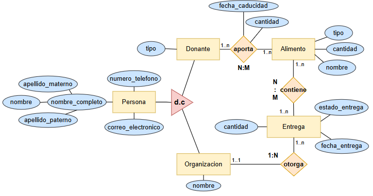

# BDAP01-Donacion-Alimentos
Aplicación en java que permite gestionar la recepción y distribución de alimentos donados mediante MySQL y Java de la manera mas simple posible
 

 
<b>Script MySQL</b>
 
CREATE DATABASE IF NOT EXISTS sistema_donaciones;
USE sistema_donaciones;
CREATE TABLE personas (
    id_persona INT NOT NULL AUTO_INCREMENT,
    nombre VARCHAR(50) NOT NULL,
    apellido_paterno VARCHAR(70) NOT NULL,
    apellido_materno VARCHAR(70),
    correo_electronico VARCHAR(80) NOT NULL,
    numero_telefono VARCHAR(13) NOT NULL,
    direccion VARCHAR(50) NOT NULL,
    PRIMARY KEY (id_persona)
);
CREATE TABLE donantes (
    id_persona INT NOT NULL,
    tipo_donante VARCHAR(50),
    PRIMARY KEY (id_persona),
    FOREIGN KEY (id_persona) REFERENCES personas(id_persona)
        ON DELETE CASCADE
        ON UPDATE CASCADE
);
CREATE TABLE organizaciones (
    id_persona INT NOT NULL,
    nombre VARCHAR(50) NOT NULL,
    PRIMARY KEY (id_persona),
    FOREIGN KEY (id_persona) REFERENCES personas(id_persona)
        ON DELETE CASCADE
        ON UPDATE CASCADE
);
CREATE TABLE alimentos (
    id_alimento INT NOT NULL AUTO_INCREMENT,
    nombre VARCHAR(20) NOT NULL,
    cantidad DECIMAL(10,2) NOT NULL,
    tipo_alimento VARCHAR(20),
    PRIMARY KEY (id_alimento)
);
CREATE TABLE aportaciones (
    id_aportacion INT NOT NULL AUTO_INCREMENT,
    fecha_caducidad DATE NOT NULL,
    cantidad DECIMAL(10,2) NOT NULL,
    id_donante INT NOT NULL,
    id_alimento INT NOT NULL,
    PRIMARY KEY (id_aportacion),
    FOREIGN KEY (id_donante) REFERENCES donantes(id_persona)
        ON DELETE RESTRICT
        ON UPDATE CASCADE,
    FOREIGN KEY (id_alimento) REFERENCES alimentos(id_alimento)
        ON DELETE RESTRICT
        ON UPDATE CASCADE
);
CREATE TABLE entregas (
    id_entrega INT NOT NULL AUTO_INCREMENT,
    fecha_entrega DATE NOT NULL,
    estado_entrega ENUM('pendiente', 'en_transito', 'entregada', 'cancelada') NOT NULL,
    id_organizacion INT NOT NULL,
    PRIMARY KEY (id_entrega),
    FOREIGN KEY (id_organizacion) REFERENCES organizaciones(id_persona)
        ON DELETE RESTRICT
        ON UPDATE CASCADE
);
CREATE TABLE contenidos (
    id_contenido INT NOT NULL AUTO_INCREMENT,
    id_alimento INT NOT NULL,
    id_entrega INT NOT NULL,
    id_aportacion INT NOT NULL,
    PRIMARY KEY (id_contenido),
    FOREIGN KEY (id_alimento) REFERENCES alimentos(id_alimento)
        ON DELETE RESTRICT
        ON UPDATE CASCADE,
    FOREIGN KEY (id_entrega) REFERENCES entregas(id_entrega)
        ON DELETE CASCADE
        ON UPDATE CASCADE,
    FOREIGN KEY (id_aportacion) REFERENCES aportaciones(id_aportacion)
        ON DELETE RESTRICT
        ON UPDATE CASCADE
);

