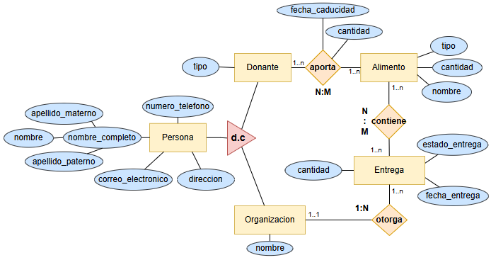

# 🍽️ Sistema de Donaciones de Alimentos
### Contexto de la aplicacion
Plataforma de Donación de Alimentos
En la ciudad se desperdician diariamente toneladas de comida en supermercados, restaurantes y otros establecimientos, mientras que miles de familias viven en situación de inseguridad alimentaria. Ante esta problemática, un grupo de jóvenes propone el desarrollo de una plataforma digital de donación de alimentos que conecte a donadores con organizaciones comunitarias que los distribuyan a quienes más lo necesitan.

<br>

El sistema deberá contemplar los siguientes aspectos:
Registro de donadores: cada donador podrá registrarse proporcionando información como nombre, tipo de donador (supermercado, restaurante, particular, etc.), dirección, teléfono y correo electrónico.

<br>

Registro de alimentos donados: cada vez que un donador realice una aportación, se deberá registrar el nombre del alimento, su categoría (por ejemplo: frutas, verduras, enlatados, panadería, etc.), la fecha de caducidad y la cantidad disponible, vinculándolo con el donador que lo proporciona.

<br>

Registro de organizaciones beneficiarias: las organizaciones comunitarias que recibirán los apoyos también deberán registrarse, indicando nombre, responsable, dirección, teléfono y correo electrónico.

<br>

Gestión de entregas: cada entrega deberá quedar registrada con información como la fecha de entrega, el alimento entregado, la organización beneficiada y el estado de la entrega (pendiente, en tránsito, completada, cancelada), lo que permitirá dar un seguimiento claro y transparente de los productos desde su donación hasta


<br>
<b>Diagrama Entidad Relacion</b>
<br>



<br>

> **Nota**: leer hasta el final, estan los SP y las Vistas

### Script MySQL

```sql
-- Creación de la base de datos implementando configuraciones de cascada
CREATE DATABASE IF NOT EXISTS sistema_donaciones;
USE sistema_donaciones;

-- Tabla de personas
CREATE TABLE personas (
    id_persona INT NOT NULL AUTO_INCREMENT,
    nombre VARCHAR(50) NOT NULL,
    apellido_paterno VARCHAR(70) NOT NULL,
    apellido_materno VARCHAR(70),
    correo_electronico VARCHAR(80) NOT NULL,
    numero_telefono VARCHAR(13) NOT NULL,
    direccion VARCHAR(50) NOT NULL,
    PRIMARY KEY (id_persona)
);

-- Tabla de donantes
CREATE TABLE donantes (
    id_persona INT NOT NULL,
    tipo_donante VARCHAR(50),
    PRIMARY KEY (id_persona),
    FOREIGN KEY (id_persona) REFERENCES personas(id_persona)
        ON DELETE CASCADE
        ON UPDATE CASCADE
);

-- Tabla de organizaciones  
CREATE TABLE organizaciones (
    id_persona INT NOT NULL,
    nombre VARCHAR(50) NOT NULL,
    PRIMARY KEY (id_persona),
    FOREIGN KEY (id_persona) REFERENCES personas(id_persona)
        ON DELETE CASCADE
        ON UPDATE CASCADE
);

-- Tabla de alimentos
CREATE TABLE alimentos (
    id_alimento INT NOT NULL AUTO_INCREMENT,
    nombre VARCHAR(20) NOT NULL,
    cantidad DECIMAL(10,2) NOT NULL,
    tipo_alimento VARCHAR(20),
    PRIMARY KEY (id_alimento)
);

-- Tabla de aportaciones
CREATE TABLE aportaciones (
    id_aportacion INT NOT NULL AUTO_INCREMENT,
    fecha_caducidad DATE NOT NULL,
    cantidad DECIMAL(10,2) NOT NULL,
    
    id_donante INT NOT NULL,
    id_alimento INT NOT NULL,
    PRIMARY KEY (id_aportacion),
    FOREIGN KEY (id_donante) REFERENCES donantes(id_persona)
        ON DELETE RESTRICT
        ON UPDATE CASCADE,
    FOREIGN KEY (id_alimento) REFERENCES alimentos(id_alimento)
        ON DELETE RESTRICT
        ON UPDATE CASCADE
);

-- Tabla de entregas
CREATE TABLE entregas (
    id_entrega INT NOT NULL AUTO_INCREMENT,
    fecha_entrega DATE NOT NULL,
    estado_entrega ENUM('pendiente', 'en_transito', 'entregada', 'cancelada') NOT NULL,
    id_organizacion INT NOT NULL,
    PRIMARY KEY (id_entrega),
    FOREIGN KEY (id_organizacion) REFERENCES organizaciones(id_persona)
        ON DELETE RESTRICT
        ON UPDATE CASCADE
);

-- Tabla de contenidos
CREATE TABLE contenidos (
    id_contenido INT NOT NULL AUTO_INCREMENT,
    id_alimento INT NOT NULL,
    id_entrega INT NOT NULL,
    id_aportacion INT NOT NULL,
    
    PRIMARY KEY (id_contenido),
    FOREIGN KEY (id_alimento) REFERENCES alimentos(id_alimento)
        ON DELETE RESTRICT
        ON UPDATE CASCADE,
    FOREIGN KEY (id_entrega) REFERENCES entregas(id_entrega)
        ON DELETE CASCADE
        ON UPDATE CASCADE,
    FOREIGN KEY (id_aportacion) REFERENCES aportaciones(id_aportacion)
        ON DELETE RESTRICT
        ON UPDATE CASCADE
);
```

### Modulos SP Utilizados

```sql
DELIMITER $

DROP PROCEDURE IF EXISTS sp_registrar_aportacion$

CREATE PROCEDURE sp_registrar_aportacion(
    IN p_fecha_caducidad DATE,
    IN p_cantidad DECIMAL(10,2),
    IN p_id_donante INT,
    IN p_id_alimento INT,
    OUT p_id_aportacion INT
)
BEGIN
    -- Handler para manejar errores SQL
    DECLARE EXIT HANDLER FOR SQLEXCEPTION
    BEGIN
        ROLLBACK;
        RESIGNAL;
    END;
    
    START TRANSACTION;
    
    -- Verificar que el donante existe
    IF NOT EXISTS (SELECT 1 FROM donantes WHERE id_persona = p_id_donante) THEN
        SIGNAL SQLSTATE '45000' SET MESSAGE_TEXT = 'Donante no existe';
    END IF;
    
    -- Verificar que el alimento existe
    IF NOT EXISTS (SELECT 1 FROM alimentos WHERE id_alimento = p_id_alimento) THEN
        SIGNAL SQLSTATE '45000' SET MESSAGE_TEXT = 'Alimento no existe';
    END IF;
    
    -- Insertar la aportacion
    INSERT INTO aportaciones (fecha_caducidad, cantidad, id_donante, id_alimento)
    VALUES (p_fecha_caducidad, p_cantidad, p_id_donante, p_id_alimento);
    
    -- Obtener el ID generado
    SET p_id_aportacion = LAST_INSERT_ID();
    
    COMMIT;
    
END$$

DELIMITER ;

-- SP adicional para consultar aportaciones por donante
DELIMITER $$

DROP PROCEDURE IF EXISTS sp_consultar_aportaciones_donante$$

CREATE PROCEDURE sp_consultar_aportaciones_donante(
    IN p_id_donante INT
)
BEGIN
    SELECT 
        a.id_aportacion,
        a.fecha_caducidad,
        a.cantidad,
        al.nombre AS nombre_alimento,
        al.tipo_alimento,
        CONCAT(p.nombre, ' ', p.apellido_paterno, ' ', IFNULL(p.apellido_materno, '')) AS donante
    FROM aportaciones a
    INNER JOIN alimentos al ON a.id_alimento = al.id_alimento
    INNER JOIN donantes d ON a.id_donante = d.id_persona
    INNER JOIN personas p ON d.id_persona = p.id_persona
    WHERE a.id_donante = p_id_donante
    ORDER BY a.fecha_caducidad ASC;
END$$

DELIMITER ;

-- SP para actualizar cantidad de alimento despues de aportacion
DELIMITER $$

DROP PROCEDURE IF EXISTS sp_actualizar_cantidad_alimento$$

CREATE PROCEDURE sp_actualizar_cantidad_alimento(
    IN p_id_alimento INT,
    IN p_cantidad_adicional DECIMAL(10,2),
    OUT p_mensaje VARCHAR(255)
)
BEGIN
    DECLARE v_cantidad_actual DECIMAL(10,2) DEFAULT 0;
    DECLARE v_alimento_existe INT DEFAULT 0;
    
    DECLARE EXIT HANDLER FOR SQLEXCEPTION
    BEGIN
        SET p_mensaje = 'Error al actualizar cantidad del alimento';
        ROLLBACK;
        RESIGNAL;
    END;
    
    SET p_mensaje = '';
    
    START TRANSACTION;
    
    -- Verificar que el alimento existe y obtener cantidad actual
    SELECT COUNT(*), IFNULL(MAX(cantidad), 0) 
    INTO v_alimento_existe, v_cantidad_actual
    FROM alimentos 
    WHERE id_alimento = p_id_alimento;
    
    IF v_alimento_existe = 0 THEN
        SET p_mensaje = 'El alimento especificado no existe';
        ROLLBACK;
    ELSE
        -- Actualizar la cantidad
        UPDATE alimentos 
        SET cantidad = cantidad + p_cantidad_adicional
        WHERE id_alimento = p_id_alimento;
        
        SET p_mensaje = 'Cantidad de alimento actualizada exitosamente';
        COMMIT;
    END IF;
    
END$$

DELIMITER ;
```

### Modulos de Vistas

```sql
    -- poner vistas
```

> **Nota**: gracias por llegar aca aqui tienes un Script con Insersiones para agilizar la rebicion.

### Script Insert de Apoyo
```sql
-- 1. INSERTAR PERSONAS (Base para donantes y organizaciones)
INSERT INTO personas (nombre, apellido_paterno, apellido_materno, correo_electronico, numero_telefono, direccion) VALUES
('María', 'González', 'López', 'maria.gonzalez@email.com', '5551234567', 'Av. Reforma 123, Col. Centro'),
('José', 'Martínez', 'Hernández', 'jose.martinez@email.com', '5559876543', 'Calle Juárez 45, Col. Roma'),
('Ana', 'Rodríguez', 'García', 'ana.rodriguez@email.com', '5556781234', 'Blvd. Insurgentes 789, Col. Condesa'),
('Carlos', 'López', 'Sánchez', 'carlos.lopez@email.com', '5554567890', 'Av. Universidad 321, Col. Del Valle'),
('Laura', 'Hernández', 'Morales', 'laura.hernandez@email.com', '5553456789', 'Calle Madero 567, Col. Centro'),
('Roberto', 'García', 'Jiménez', 'roberto.garcia@email.com', '5552345678', 'Av. Patriotismo 890, Col. San Pedro'),
('Carmen', 'Sánchez', 'Ruiz', 'carmen.sanchez@fundacion.org', '5557654321', 'Calle Morelos 234, Col. Doctores'),
('Francisco', 'Morales', 'Castro', 'francisco.morales@caritas.org', '5558765432', 'Av. Revolución 456, Col. San Ángel'),
('Patricia', 'Jiménez', 'Vargas', 'patricia.jimenez@bancoalimentos.org', '5559654321', 'Calle Hidalgo 678, Col. Centro');

-- 2. INSERTAR DONANTES (Personas que donan)
INSERT INTO donantes (id_persona, tipo_donante) VALUES
(1, 'Individual'),           -- Maria Gonzalez
(2, 'Empresa'),             -- Jose Martinez
(3, 'Individual'),          -- Ana Rodriguez
(4, 'Restaurante'),         -- Carlos Lopez
(5, 'Individual'),          -- Laura Hernandez
(6, 'Empresa');             -- Roberto Garcia

-- 3. INSERTAR ORGANIZACIONES (Personas/entidades que reciben)
INSERT INTO organizaciones (id_persona, nombre) VALUES
(7, 'Fundación Ayuda Social'),        -- Carmen Sanchez
(8, 'Cáritas Arquidiocesana'),        -- Francisco Morales
(9, 'Banco de Alimentos CDMX');       -- Patricia Jimenez

-- 4. INSERTAR ALIMENTOS (Inventario disponible)
INSERT INTO alimentos (nombre, cantidad, tipo_alimento) VALUES
('Arroz', 50.00, 'Cereal'),
('Frijoles', 30.00, 'Legumbre'),
('Pasta', 25.00, 'Cereal'),
('Atún', 40.00, 'Proteína'),
('Aceite', 15.00, 'Aceite'),
('Leche', 20.00, 'Lácteo'),
('Pan', 35.00, 'Panadería'),
('Manzanas', 45.00, 'Fruta'),
('Pollo', 25.00, 'Proteína'),
('Verduras', 30.00, 'Verdura'),
('Azúcar', 20.00, 'Endulzante'),
('Sal', 10.00, 'Condimento');

-- 5. INSERTAR APORTACIONES (Donaciones realizadas)
INSERT INTO aportaciones (fecha_caducidad, cantidad, id_donante, id_alimento) VALUES
-- Donaciones de Maria Gonzalez (Individual)
('2024-12-31', 10.00, 1, 1),  -- Arroz
('2025-01-15', 5.00, 1, 2),   -- Frijoles

-- Donaciones de Jose Martinez (Empresa)
('2024-11-30', 20.00, 2, 4),  -- Atun
('2025-02-28', 8.00, 2, 5),   -- Aceite
('2024-12-15', 15.00, 2, 6),  -- Leche

-- Donaciones de Ana Rodriguez (Individual)
('2025-01-20', 7.00, 3, 3),   -- Pasta
('2024-11-25', 12.00, 3, 7),  -- Pan

-- Donaciones de Carlos Lopez (Restaurante)
('2024-11-28', 18.00, 4, 8),  -- Manzanas
('2024-12-10', 22.00, 4, 9),  -- Pollo
('2025-01-05', 14.00, 4, 10), -- Verduras

-- Donaciones de Laura Hernandez (Individual)
('2025-03-15', 6.00, 5, 11),  -- Azucar
('2025-02-20', 3.00, 5, 12),  -- Sal

-- Donaciones de Roberto Garcia (Empresa)
('2025-01-10', 25.00, 6, 1),  -- Arroz
('2024-12-20', 16.00, 6, 4);  -- Atun

-- 6. INSERTAR ENTREGAS (Entregas programadas/realizadas)
INSERT INTO entregas (fecha_entrega, estado_entrega, id_organizacion) VALUES
('2024-10-15', 'entregada', 7),    -- Fundacion Ayuda Social
('2024-10-20', 'entregada', 8),    -- Caritas Arquidiocesana
('2024-10-25', 'en_transito', 9),  -- Banco de Alimentos
('2024-11-01', 'pendiente', 7),    -- Fundacion Ayuda Social
('2024-11-05', 'pendiente', 8),    -- Caritas Arquidiocesana
('2024-11-10', 'cancelada', 9);    -- Banco de Alimentos (cancelada)

-- 7. INSERTAR CONTENIDOS (Que se entrego en cada entrega)
INSERT INTO contenidos (id_alimento, id_entrega, id_aportacion) VALUES
-- Contenido de entrega 1 (Fundacion Ayuda Social - entregada)
(1, 1, 1),   -- Arroz de Maria Gonzalez
(2, 1, 2),   -- Frijoles de Maria Gonzalez
(4, 1, 3),   -- Atun de Jose Martinez

-- Contenido de entrega 2 (Caritas - entregada)
(5, 2, 4),   -- Aceite de Josr Martinez
(6, 2, 5),   -- Leche de Josr Martinez
(3, 2, 6),   -- Pasta de Ana Rodriguez

-- Contenido de entrega 3 (Banco de Alimentos - en transito)
(7, 3, 7),   -- Pan de Ana Rodriguez
(8, 3, 8),   -- Manzanas de Carlos Lopez
(9, 3, 9),   -- Pollo de Carlos Lopez

-- Contenido de entrega 4 (Fundacion - pendiente)
(10, 4, 10), -- Verduras de Carlos Lopez
(11, 4, 11), -- Azucar de Laura Hernandez

-- Contenido de entrega 5 (Caritas - pendiente)
(1, 5, 13),  -- Arroz de Roberto Garcia
(4, 5, 14);  -- Atun de Roberto Garcia
```

> **Nota**: quiero agradecer a mi perro chihuahua por hacer esto posible. 